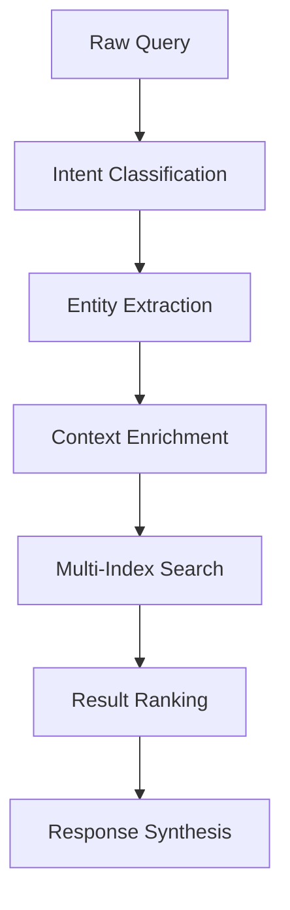

# CVA6 RAG System Structure & Data Organization

## Overview

This document defines the RAG knowledge base structure that directly supports the CVA6 verification architecture. The RAG system provides indexed, searchable access to verification plans, design implementation, ISA specifications, and test patterns to enable the main test writing agents to make informed decisions.

## RAG Agent Query Interface (Supporting Main Test Writing Agents)

The RAG agent receives queries from the three main test writing agents and returns relevant indexed content:

### A. From ISA Test Writing Agent
```yaml
# Query for ADDI instruction verification data
rag_query:
  query_text: "ADDI instruction verification goals coverage requirements register operands"
  metadata_filters:
    document_type: "verification_plan"
    verification_tag: "VP_ISA_RV32_F000_S000_I000"
    instruction: "ADDI"
```

### B. From Interface Test Writing Agent  
```yaml
# Query for AXI burst control verification
rag_query:
  query_text: "AXI burst type INCR AWBURST verification assertion requirements"
  metadata_filters:
    document_type: "verification_plan"
    module: "AXI"
    verification_tag: "VP_1_F005_S000_I000"
```

### C. From System Test Writing Agent
```yaml
# Query for MMU page table walk verification
rag_query:
  query_text: "MMU page table walk SV32 verification PTE validation exception"
  metadata_filters:
    document_type: "verification_plan"
    module: "MMU_SV32" 
    feature: "page_table_walk"
```

### D. Testlist Configuration Queries (From All Agents)
```yaml
# ISA Test Writing Agent querying for ADDI test configuration
rag_query:
  query_text: "ADDI instruction test configuration gcc options compilation ISA test setup"
  metadata_filters:
    document_type: "test_configuration"
    test_category: "isa_tests"
    instruction_coverage: "RV32I"

# Interface Test Writing Agent querying for CVXIF test configuration  
rag_query:
  query_text: "CVXIF coprocessor interface test configuration simulation options protocol"
  metadata_filters:
    document_type: "test_configuration"
    test_category: "coprocessor_interface"
    interface_type: "cvxif"

# System Test Writing Agent querying for hardware configuration tests
rag_query:
  query_text: "hardware configuration test setup system parameters UVM testbench options"
  metadata_filters:
    document_type: "test_configuration"
    test_category: "hardware_configuration" 
    test_scope: "system_level"
```

## RAG Response Format (What Main Test Writing Agents Receive)

### A. Response to ISA Test Writing Agent
```yaml
# RAG response for ADDI verification query
rag_response:
  documents_found: 3
  total_relevance_score: 0.94
  retrieved_content:
    - document_id: "dvplan_ISA_RV32_addi_000"
      source: "verif/docs/VerifPlans/source/dvplan_ISA_RV32.md"
      content: |
        "All possible rs1 registers are used.
         All possible rd registers are used.
         All possible register combinations where rs1 == rd are used"
      metadata:
        verification_tag: "VP_ISA_RV32_F000_S000_I000"
        coverage_links: ["isacov.rv32i_addi_cg.cp_rs1", "isacov.rv32i_addi_cg.cp_rd"]
        pass_criteria: "Check RM"
```

### B. Response to Interface Test Writing Agent
```yaml
# RAG response for AXI burst verification query  
rag_response:
  documents_found: 2
  total_relevance_score: 0.91
  retrieved_content:
    - document_id: "dvplan_axi_burst_control"
      source: "verif/docs/VerifPlans/source/dvplan_AXI.md"
      content: |
        "All transaction performed by CVA6 are of type INCR. AxBURST = 0b01
         Ensure that AxBURST == 0b01 is always true while AxVALID is asserted."
      metadata:
        verification_tag: "VP_1_F005_S000_I000"
        verification_method: "Assertion"
        target_signals: ["AWBURST", "ARBURST", "AWVALID", "ARVALID"]
```

### C. Response to System Test Writing Agent
```yaml
# RAG response for MMU verification query
rag_response:
  documents_found: 2
  total_relevance_score: 0.88
  retrieved_content:
    - document_id: "dvplan_mmu_sv32_ptw"
      source: "verif/docs/VerifPlans/source/dvplan_MMU_SV32.md"
      content: |
        "Page table walk for valid entries produces correct physical address
         Page table walk for invalid PTEs generates page fault exception"
      metadata:
        verification_tag: "VP_MMU_SV32_F001_S000_I000"
        coverage_targets: ["mmu_cg.page_fault", "mmu_cg.valid_translation"]
```

### D. Testlist Configuration Responses (To All Agents)
```yaml
# Response to ISA Test Writing Agent for ADDI test configuration
rag_response:
  documents_found: 3
  total_relevance_score: 0.92
  retrieved_content:
    - document_id: "testlist_riscv_tests_cv32a60x_addi"
      source: "verif/tests/testlist_riscv-tests-cv32a60x-p.yaml"
      content: |
        "- test: rv32ui-p-addi
           iterations: 1
           asm_tests: <path_var>/riscv-tests/isa/rv32ui/addi.S"
      metadata:
        gcc_opts: "-static -mcmodel=medany -fvisibility=hidden -nostdlib -nostartfiles"
        include_paths: ["<path_var>/riscv-tests/isa/macros/scalar/"]
        test_category: "isa_tests"

# Response to Interface Test Writing Agent for CVXIF configuration
rag_response:
  documents_found: 2
  total_relevance_score: 0.89
  retrieved_content:
    - document_id: "testlist_cvxif_config"
      source: "verif/tests/testlist_cvxif.yaml"
      content: |
        "gen_opts: '--enable_cvxif --cvxif_extension_list=cv_xif'
         sim_opts: '+cvxif_req_resp_protocol=1'
         iterations: 10"
      metadata:
        interface_type: "cvxif"
        protocol_options: ["req_resp_protocol"]
        test_category: "coprocessor_interface"

# Response to System Test Writing Agent for hardware configuration  
rag_response:
  documents_found: 1
  total_relevance_score: 0.85
  retrieved_content:
    - document_id: "testlist_hwconfig_system"
      source: "verif/tests/testlist_hwconfig.yaml"
      content: |
        "iterations: 50
         sim_opts: '+UVM_TESTNAME=uvmt_cva6_firmware_test_c +RVFI=1'
         gen_opts: '--num_of_tests=10 --enable_sfence_exception'"
      metadata:
        system_parameters: ["RVFI=1", "NUM_HARTS=1"]
        uvm_testbench: "uvmt_cva6_firmware_test_c"
        test_category: "hardware_configuration"
```

## Knowledge Base Structure (Supporting the 3 Main Test Writing Agents)

The RAG knowledge base is organized to efficiently serve queries from:
1. **ISA Test Writing Agent** - needs verification plans, ISA specs, design interfaces for instructions
2. **Interface Test Writing Agent** - needs verification plans, protocol specs, design implementations for interfaces  
3. **System Test Writing Agent** - needs verification plans, system specs, integration requirements

## Indexed Document Types & Their Role in Test Generation

### 1. Verification Plans → Enable Decision Making for All Test Writing Agents
```yaml
document_type: verification_plan
purpose: "Provides verification requirements that test writing agents translate into test strategies"
indexed_for: "All 3 main test writing agents"

# Example: ISA Test Writing Agent uses this
metadata:
  module: "ISA_RV32"
  feature: "Register-Immediate Instructions" 
  sub_feature: "ADDI"
  verification_tag: "VP_ISA_RV32_F000_S000_I000"
  supports_agent: "ISA_Test_Writer"
content:
  verification_goals: 
    - "All possible rs1 registers are used"  # → Agent decides: constraint rs1 inside {[1:31]}
    - "All possible rd registers are used"   # → Agent decides: constraint rd inside {[0:31]}
  coverage_links: 
    - "isacov.rv32i_addi_cg.cp_rs1"         # → Agent decides: add to covergroup
  test_type: "Constrained Random"            # → Agent decides: use randomization approach

# Example: Interface Test Writing Agent uses this  
metadata:
  module: "AXI"
  feature: "Burst"
  verification_tag: "VP_1_F005_S000_I000"
  supports_agent: "Interface_Test_Writer"
content:
  requirement: "All transactions are INCR type (AxBURST = 0b01)"  # → Agent decides: create assertion
  verification_method: "Assertion"                                # → Agent decides: assertion-based approach
  target_signals: ["AWBURST", "ARBURST"]                         # → Agent decides: monitor these signals
```

### 2. Design Implementation → Informs Test Writing Agents About Implementation Reality
```yaml
document_type: design_implementation
purpose: "Provides actual CVA6 implementation details that test writing agents use to create realistic tests"
indexed_for: "Primarily ISA and Interface Test Writing Agents"

# Example: ISA Test Writing Agent uses this to understand ALU interface
metadata:
  file_path: "core/alu.sv"
  module_name: "alu" 
  category: "execution_unit"
  supports_agent: "ISA_Test_Writer"
content:
  interfaces:
    inputs: ["operand_a_i", "operand_b_i", "operator_i"]    # → Agent decides: create drivers for these
    outputs: ["result_o", "comparison_result_o"]            # → Agent decides: create checkers for these
  functionality: "32-bit arithmetic operations"             # → Agent decides: focus on 32-bit test values

# Example: Interface Test Writing Agent uses this to understand AXI implementation
metadata:
  file_path: "core/cache_subsystem/axi_adapter.sv"
  category: "cache_subsystem"
  supports_agent: "Interface_Test_Writer"
content:
  axi_implementation: |
    "assign axi_req_o.aw.burst = axi_pkg::BURST_INCR;      # → Agent decides: only test INCR bursts
     assign axi_req_o.ar.burst = axi_pkg::BURST_INCR;"     # → Agent knows: no need to test other burst types
```

### 3. ISA Specifications (RISC-V Official Manual) → Authoritative Instruction Behavior
```yaml
document_type: isa_specification  
purpose: "Official RISC-V manual providing authoritative instruction definitions for correctness verification"
indexed_for: "Primarily ISA Test Writing Agent"

# Example: ISA Test Writing Agent uses official RISC-V spec for ADDI
metadata:
  specification_file: "riscv-isa-manual/src/unpriv/rv32.adoc"
  chapter: "RV32I Base Integer Instruction Set"
  instruction_category: "integer_register_immediate"
  supports_agent: "ISA_Test_Writer"
content:
  official_definition: "ADDI adds the sign-extended 12-bit immediate to register rs1"
  register_model: "32 x registers each 32 bits wide, x0 hardwired to zero"
  normative_requirements:
    - "x0 hardwired with all bits equal to 0"              # → Agent decides: test x0 behavior
    - "Arithmetic overflow ignored, result is low XLEN bits" # → Agent decides: no overflow checking
  instruction_encoding: "I-type format with specific bit layout"
  behavioral_specification: "Detailed operation semantics from official source"
  
# Cross-reference with riscv-tests implementation
cross_reference:
  official_spec: "ADDI definition in RISC-V manual"         # → Authoritative behavior
  reference_implementation: "riscv-tests/isa/rv64ui/addi.S" # → Proven test patterns
  cva6_verification: "dvplan_ISA_RV32.md ADDI requirements" # → CVA6-specific goals
```

### 4. Test Examples → Inform Test Writing Agents About Existing Patterns
```yaml
document_type: test_example  
purpose: "Provides existing test patterns that test writing agents can adapt or avoid duplicating"
indexed_for: "All 3 main test writing agents"

# Example: ISA Test Writing Agent uses this to learn constraint patterns
metadata:
  test_name: "register_coverage_test"
  test_type: "constrained_random"
  target_feature: "register_constraints"
  supports_agent: "ISA_Test_Writer"
content:
  existing_constraints: |
    "constraint rs1_c { rs1 inside {[1:31]}; }              # → Agent learns: exclude x0 pattern
     constraint rd_c { rd inside {[0:31]}; }"               # → Agent learns: include x0 pattern
  coverage_approach: |
    "covergroup addi_cg @(posedge clk);
       cp_rs1: coverpoint rs1;                              # → Agent learns: simple coverpoint style
       cp_rd: coverpoint rd;"                               # → Agent adapts: similar coverage structure

# Example: Interface Test Writing Agent uses this to learn assertion patterns  
metadata:
  test_name: "axi_burst_check"
  test_type: "assertion_based"
  target_feature: "interface_compliance"
  supports_agent: "Interface_Test_Writer"
content:
  assertion_pattern: |
    "assert property (@(posedge clk)                        # → Agent learns: clocked assertion pattern
       axi_if.awvalid |-> axi_if.awburst == 2'b01)"        # → Agent adapts: similar signal checking
```

### 5. Test Lists → Guide Test Writing Agents on Test Configuration and Infrastructure
```yaml
document_type: test_configuration
purpose: "Provides test suite organization, compilation options, and simulation parameters that agents use to generate properly configured tests"
indexed_for: "All 3 main test writing agents"

# Example: ISA Test Writing Agent uses this to understand ISA test configuration
metadata:
  testlist_name: "testlist_riscv-tests-cv32a60x-p"
  test_category: "isa_tests" 
  target_core: "cv32a60x"
  privilege_mode: "machine"
  supports_agent: "ISA_Test_Writer"
content:
  test_structure: |
    "- test: rv32ui-p-addi                                  # → Agent learns: test naming convention
       iterations: 1                                       # → Agent decides: single iteration sufficient
       asm_tests: <path_var>/riscv-tests/isa/rv32ui/addi.S # → Agent learns: ISA test file structure"
  compilation_config: |
    "gcc_opts: '-static -mcmodel=medany -fvisibility=hidden # → Agent uses: same gcc options
     -nostdlib -nostartfiles                               # → Agent learns: baremetal compilation
     -I<path_var>/riscv-tests/isa/macros/scalar/'"          # → Agent learns: required include paths

# Example: System Test Writing Agent uses this to understand system test configuration  
metadata:
  testlist_name: "testlist_hwconfig"
  test_category: "hardware_configuration"
  target_feature: "system_parameters"
  supports_agent: "System_Test_Writer"
content:
  configuration_matrix: |
    "iterations: 50                                         # → Agent learns: higher iterations for system tests
     sim_opts: '+UVM_TESTNAME=uvmt_cva6_firmware_test_c'   # → Agent learns: UVM test configuration
     gen_opts: '--num_of_tests=10 --enable_sfence_exception' # → Agent learns: generator options"
  system_parameters: |
    "RVFI=1                                                 # → Agent learns: RVFI interface enabled
     NUM_HARTS=1                                           # → Agent learns: single hart configuration
     PITON_ARIANE=0"                                       # → Agent learns: standalone vs integrated mode

# Example: Interface Test Writing Agent uses this to understand interface test setup
metadata:
  testlist_name: "testlist_cvxif"
  test_category: "coprocessor_interface"
  target_feature: "cvxif_protocol"
  supports_agent: "Interface_Test_Writer"
content:
  interface_config: |
    "cvxif_test: cv32a65x_cvxif_test                        # → Agent learns: interface test naming
     gen_opts: '--enable_cvxif --cvxif_extension_list=cv_xif' # → Agent learns: CVXIF-specific options
     sim_opts: '+cvxif_req_resp_protocol=1'"               # → Agent learns: protocol simulation options
  test_organization: |
    "- test: cvxif_add_nop                                  # → Agent learns: specific interface operations
     - test: cvxif_rs1_rs2_ops                             # → Agent learns: operand testing patterns
     - test: cvxif_compressed_if"                          # → Agent learns: compressed interface testing
```

### 5. Configuration Data (config/)
```yaml
document_type: configuration
metadata:
  config_name: "CV32A60X"
  target_core: "cv32a60x" 
  file_path: "config/riscv-config/cv32a65x/spec/isa_spec.yaml"
content:
  isa_parameters:
    xlen: 32
    extensions: ["I", "M", "A", "C", "Zicsr", "Zifencei"]
    privilege_modes: ["M", "U"]
  cache_configuration:
    icache_size: "16KB"
    dcache_size: "16KB"
    cache_line_size: "128b"
  memory_parameters:
    physical_addr_sz: 34
    virtual_memory: false
  custom_extensions: ["Xcorev"]
```

## Indexing Strategy (Optimized for Main Test Writing Agent Queries)

### Query-Optimized Document Structure
```
Indexed for ISA Test Writing Agent:
├── verification_plan + instruction_name + verification_tag
├── isa_specification + instruction_name + extension  
├── design_implementation + execution_unit + instruction_processing
└── test_example + constrained_random + register_patterns

Indexed for Interface Test Writing Agent:
├── verification_plan + interface_name + protocol_feature
├── interface_specification + protocol_name + signal_definitions
├── design_implementation + interface_modules + protocol_implementation  
└── test_example + assertion_based + interface_compliance

Indexed for System Test Writing Agent:
├── verification_plan + system_feature + integration_requirements
├── system_specification + configuration_parameters + system_behavior
├── design_implementation + system_modules + multi_component_interaction
└── test_example + system_level + performance_testing
```

### Cross-Agent Indexing (Documents Used by Multiple Agents)
```yaml
shared_documents:
  verification_plans:
    used_by: ["ISA_Test_Writer", "Interface_Test_Writer", "System_Test_Writer"]
    reason: "All agents need verification requirements for their domain"
    
  design_implementation:  
    used_by: ["ISA_Test_Writer", "Interface_Test_Writer"]
    reason: "Both need to understand actual CVA6 implementation details"
    
  test_configurations: # **CRITICAL ADDITION**
    used_by: ["ISA_Test_Writer", "Interface_Test_Writer", "System_Test_Writer"]  
    reason: "All agents need testlist patterns for proper test infrastructure setup"
    specific_usage:
      ISA_Test_Writer: "Learn gcc_opts, include paths, ISA test naming conventions"
      Interface_Test_Writer: "Learn interface-specific simulation options and protocol settings"  
      System_Test_Writer: "Learn UVM configuration, system parameters, hardware test setup"
      
  riscv_test_suite: # **NEW CRITICAL ADDITION**
    used_by: ["ISA_Test_Writer"]
    reason: "Provides actual reference test implementations for RISC-V instructions"
    specific_usage:
      ISA_Test_Writer: "Learn proven test patterns, edge cases, test macro usage, comprehensive instruction testing approaches"
    cross_references: "Links testlist entries to actual test implementations"
    
  configuration_data:
    used_by: ["ISA_Test_Writer", "System_Test_Writer"] 
    reason: "Both need to know enabled features and system parameters"
```

### Multi-dimensional Indexing

#### Metadata-Based Indexing
```yaml
primary_keys:
  - document_type
  - verification_tag
  - module_name
  - instruction_name
  - file_path

secondary_keys:
  - feature_category
  - test_type
  - applicable_cores
  - dependencies
  - coverage_targets
```

#### Semantic Embedding Indexing
- **Natural Language Queries:** Vector embeddings for flexible search
- **Cross-Document Relationships:** Link verification plans ↔ design ↔ ISA specs
- **Concept Clustering:** Group related concepts (registers, instructions, interfaces)

### Search Query Processing Pipeline



#### Query Processing Steps

1. **Intent Classification**
   - Determine query type (verification_plan, design_impl, isa_spec, test_example)
   - Identify information need (goals, coverage, interface, constraints)

2. **Entity Extraction**
   - Extract key entities: module names, instruction names, signal names
   - Map to canonical forms in knowledge base

3. **Context Enrichment**
   - Add related entities and cross-references
   - Include hierarchical relationships (parent/child modules)

4. **Multi-Index Search Strategy**
   ```yaml
   search_strategy:
     exact_match:
       - verification_tag lookup
       - instruction_name lookup
       - module_name lookup
     semantic_search:
       - vector similarity search
       - concept-based matching
     hybrid_ranking:
       - combine exact + semantic scores
       - boost by document freshness
       - weight by cross-reference count
   ```

5. **Result Ranking Factors**
   - **Relevance Score:** Metadata match + semantic similarity
   - **Completeness:** Availability of required fields
   - **Authority:** Source document credibility
   - **Freshness:** Last modified timestamp

## Key File Locations in CVA6 (Indexed in RAG Knowledge Base)

### Verification Plans
- `verif/docs/VerifPlans/source/dvplan_ISA_RV32.md` - RV32 instruction verification (296KB)
- `verif/docs/VerifPlans/source/dvplan_AXI.md` - AXI interface verification (18KB)
- `verif/docs/VerifPlans/source/dvplan_MMU_SV32.md` - MMU verification (28KB)
- `verif/docs/VerifPlans/source/dvplan_PMP.md` - PMP verification (771KB)
- `verif/docs/VerifPlans/source/dvplan_CVXIF.md` - CVXIF coprocessor interface (34KB)

### Core Implementation
- `core/cva6.sv` - Top-level CVA6 module (75KB)
- `core/alu.sv` - Arithmetic Logic Unit (16KB)
- `core/frontend/frontend.sv` - Instruction fetch and branch prediction (24KB)
- `core/cache_subsystem/` - Cache implementation directory
- `core/decoder.sv` - Instruction decoder (95KB)

### Test Configurations (Testlists) - **Critical for Test Generation**
- `verif/tests/testlist_riscv-tests-cv32a60x-p.yaml` - ISA tests for CV32A60X (14KB)
- `verif/tests/testlist_riscv-arch-test-cv64a6_imafdc_sv39.yaml` - Architecture tests CV64A6 (38KB)
- `verif/tests/testlist_cvxif.yaml` - CVXIF coprocessor interface tests (3KB)
- `verif/tests/testlist_custom.yaml` - Custom directed tests (2KB)
- `verif/tests/testlist_isacov.yaml` - ISA coverage-driven tests (3KB)
- `verif/tests/testlist_hwconfig.yaml` - Hardware configuration tests (5KB)
- `verif/tests/testlist_interrupt.yaml` - Interrupt handling tests (2KB)
- `verif/tests/testlist_pmp-cv32a65x.yaml` - PMP tests for CV32A65X (3KB)
- `verif/tests/testlist_riscv-compliance-*.yaml` - RISC-V compliance tests (~30KB each)
- `verif/tests/testlist_riscv-csr-access-test-*.yaml` - CSR access tests (5KB each)

### Test Infrastructure
- `verif/tests/custom/` - Custom test cases and common files
- `verif/docs/UVM_verif_env.md` - UVM environment documentation

### ISA Specifications
- `riscv-isa-manual/src/unpriv/` - Unprivileged architecture specs
- `riscv-isa-manual/src/priv/` - Privileged architecture specs

### RISC-V Test Suite (Referenced by CVA6 Testlists) - **Critical Addition**
- `riscv-tests/isa/rv32ui/*.S` - RV32 user-level integer tests (143 files)
- `riscv-tests/isa/rv64ui/*.S` - RV64 user-level integer tests (143 files)
- `riscv-tests/isa/rv32mi/*.S` - RV32 machine-level tests (22 files)
- `riscv-tests/isa/rv64mi/*.S` - RV64 machine-level tests (24 files)
- `riscv-tests/benchmarks/dhrystone/` - Performance benchmark tests
- `riscv-tests/isa/macros/` - Shared test macros and infrastructure

## Implementation Recommendations

### Data Extraction Pipeline
1. **Document Parsing:** Extract structured data from markdown, SystemVerilog, AsciiDoc
2. **Metadata Generation:** Create rich metadata for each document section
3. **Cross-Reference Mapping:** Link related concepts across document types
4. **Embedding Generation:** Create semantic embeddings for all content
5. **Index Building:** Build multi-dimensional search indexes

### Query Optimization
1. **Caching Strategy:** Cache frequent queries and intermediate results
2. **Index Partitioning:** Partition by document type for faster search
3. **Incremental Updates:** Support incremental index updates for new content
4. **Query Rewriting:** Optimize queries for better retrieval performance