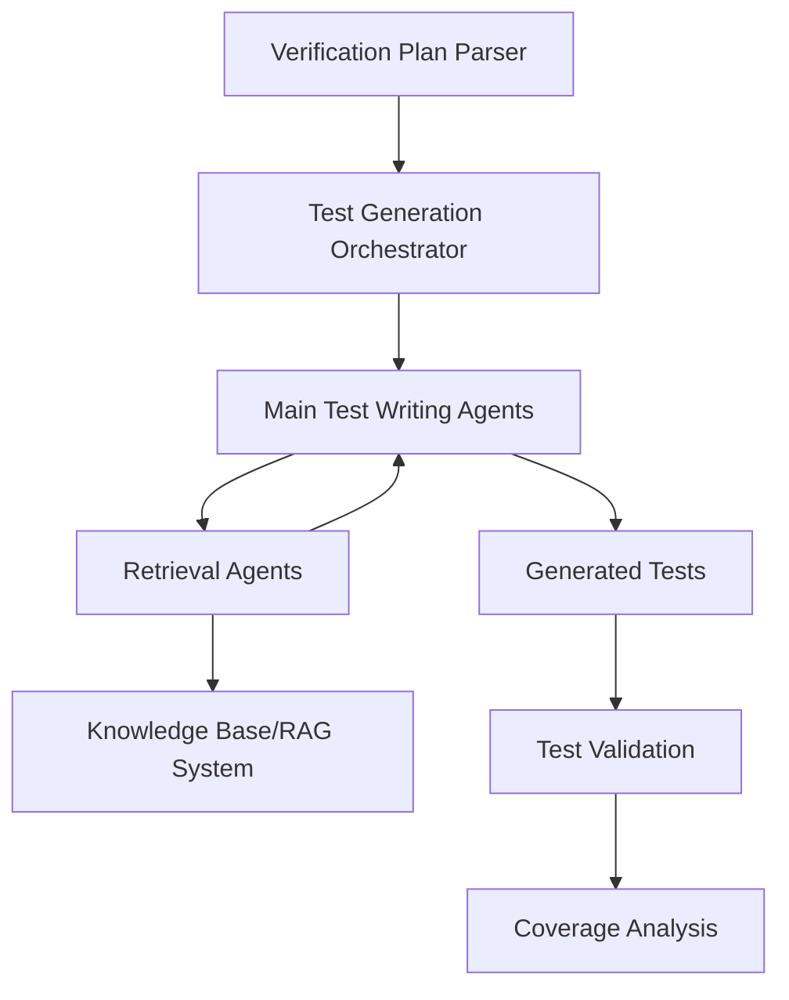

# CVA6 Verification Architecture & Workflow

## Overview

The CVA6 verification system uses an agent-based architecture where specialized test generation agents collaborate with retrieval agents to automatically generate comprehensive test suites based on verification plans.

## Verification Plan Execution Flow



## Agent Responsibility Separation

### Main Test Writing Agents (Decision Makers)
- **Responsibility:** Generate actual test code, constraints, and coverage
- **Logic:** All test generation logic and decision making
- **Inputs:** Raw verification requirements + data from retrieval agents
- **Outputs:** Complete executable test suites

### Retrieval Agents (Data Providers)  
- **Responsibility:** Fetch and expose relevant data only
- **Logic:** Query processing, data retrieval, formatting for consumption
- **Inputs:** Specific data requests from main agents
- **Outputs:** Structured raw data with no interpretation or decisions

## Phase-by-Phase Workflow

### Phase 1: Verification Plan Parsing

The system begins by parsing structured verification plans into actionable test items:

```yaml
input: 
  file: "verif/docs/VerifPlans/source/dvplan_ISA_RV32.md"
  
parsing_result:
  - feature: "RV32I Register-Immediate Instructions"
    sub_features:
      - name: "ADDI"
        items:
          - id: "000"
            verification_tag: "VP_ISA_RV32_F000_S000_I000"
            goals: ["All possible rs1 registers are used"]
            test_type: "Constrained Random"
            coverage: ["isacov.rv32i_addi_cg.cp_rs1"]
```

**Key Elements:**
- **Verification Tag:** Unique identifier linking plan items to tests
- **Goals:** Specific verification objectives to achieve
- **Coverage:** SystemVerilog coverage points to collect
- **Test Type:** Methodology (constrained random, directed, assertion-based)

### Phase 2: Test Generation Agent Spawning

Based on parsed verification items, specialized test generation agents are instantiated:

```yaml
test_agents:
  - agent_type: "ISA_Test_Generator"
    target_feature: "ADDI_instruction"
    verification_item: "VP_ISA_RV32_F000_S000_I000"
    
  - agent_type: "AXI_Test_Generator"  
    target_feature: "burst_control"
    verification_item: "VP_1_F005_S000_I000"
    
  - agent_type: "MMU_Test_Generator"
    target_feature: "page_table_walk"
    verification_item: "VP_MMU_SV32_F001_S000_I000"
```

### Phase 3: Data Retrieval (Retrieval Agents)

Main test writing agents request specific data from retrieval agents:

#### ISA Test Writer → RAG Agent Interaction
```yaml
# Request 1: Get Verification Plan for ADDI
rag_query_1:
  query_text: "ADDI instruction verification goals coverage requirements register operands"
  metadata_filters:
    document_type: "verification_plan"
    verification_tag: "VP_ISA_RV32_F000_S000_I000" 
    feature: "Register-Immediate Instructions"
    sub_feature: "ADDI"

# RAG Response 1
rag_response_1:
  documents_found: 1
  relevance_score: 0.95
  retrieved_content:
    - document_id: "dvplan_ISA_RV32_addi_000"
      source: "verif/docs/VerifPlans/source/dvplan_ISA_RV32.md"
      content: |
        "### Sub-feature: 000_ADDI
        #### Item: 000
        * **Verification Goals**
          All possible rs1 registers are used.
          All possible rd registers are used.
          All possible register combinations where rs1 == rd are used
        * **Link to Coverage:** isacov.rv32i_addi_cg.cp_rs1
        isacov.rv32i_addi_cg.cp_rd
        isacov.rv32i_addi_cg.cp_rd_rs1_hazard"
      metadata:
        verification_tag: "VP_ISA_RV32_F000_S000_I000"
        pass_criteria: "Check RM"
        test_type: "Constrained Random"

# Request 2: Get ISA Specification for ADDI  
rag_query_2:
  query_text: "ADDI instruction encoding immediate add register rs1 rd operation semantics"
  metadata_filters:
    document_type: "isa_specification"
    instruction: "ADDI"
    extension: "RV32I"

# RAG Response 2
rag_response_2:
  documents_found: 2
  relevance_score: 0.92
  retrieved_content:
    - document_id: "riscv_isa_addi_encoding"
      source: "riscv-isa-manual/src/unpriv/rv32.adoc"
      content: |
        "ADDI adds the sign-extended 12-bit immediate to register rs1.
        Encoding: imm[11:0] rs1[4:0] 000 rd[4:0] 0010011
        Operation: x[rd] = x[rs1] + sext(imm)
        Arithmetic overflow is ignored and the result is simply the low XLEN bits."
      metadata:
        instruction_format: "I-type"
        valid_ranges: 
          immediate: "[-2048, 2047]"
          registers: "[0, 31]"

# Request 3: Get Design Implementation Details
rag_query_3:
  query_text: "ALU decoder immediate operand ADDI implementation module interface signals"
  metadata_filters:
    document_type: "design_implementation"
    category: "execution_unit"
    modules: ["alu", "decoder"]

# RAG Response 3  
rag_response_3:
  documents_found: 3
  relevance_score: 0.88
  retrieved_content:
    - document_id: "cva6_alu_interface"
      source: "core/alu.sv"
      content: |
        "module alu import ariane_pkg::*;
        input logic [31:0] operand_a_i,
        input logic [31:0] operand_b_i,  
        input fu_op operator_i,
        output logic [31:0] result_o"
      metadata:
        file_path: "core/alu.sv"
        line_range: [18, 45]
    - document_id: "cva6_decoder_addi"
      source: "core/decoder.sv"  
      content: |
        "ADDI: begin
          decoded_instruction.op = ARIANE_PKG::ADD;
          decoded_instruction.rs1 = instruction_i[19:15];
          decoded_instruction.rd = instruction_i[11:7];
          decoded_instruction.imm = {{20{instruction_i[31]}}, instruction_i[31:20]};"
      metadata:
        file_path: "core/decoder.sv"
        line_range: [245, 255]

# Request 4: Get Existing Test Patterns
rag_query_4:
  query_text: "register constraints rs1 rd immediate range ADDI test patterns SystemVerilog"
  metadata_filters:
    document_type: "test_example"
    target_feature: "register_constraints"
    test_type: "constrained_random"

# RAG Response 4
rag_response_4:
  documents_found: 4
  relevance_score: 0.85
  retrieved_content:
    - document_id: "addi_constraint_pattern_1"
      source: "verif/tests/custom/isa_tests/register_tests.sv"
      content: |
        "constraint rs1_c {
          rs1 inside {[1:31]};  // Exclude x0 for meaningful testing
        }
        constraint rd_c {
          rd inside {[0:31]};   // Include all registers  
        }"
      metadata:
        test_name: "register_coverage_test"
        constraint_type: "register_allocation"
```

#### AXI Test Writer → RAG Agent Interaction
```yaml
# Request 1: Get AXI Verification Requirements
rag_query_1:
  query_text: "AXI burst type INCR AWBURST ARBURST transaction control signals verification"
  metadata_filters:
    document_type: "verification_plan"
    verification_tag: "VP_1_F005_S000_I000"
    module: "AXI"
    feature: "Burst"

# RAG Response 1
rag_response_1:
  documents_found: 1
  relevance_score: 0.94
  retrieved_content:
    - document_id: "dvplan_axi_burst_control"
      source: "verif/docs/VerifPlans/source/dvplan_AXI.md"
      content: |
        "#### Item: 000
        * **Feature Description**
          All transaction performed by CVA6 are of type INCR. AxBURST = 0b01
        * **Verification Goals**  
          Ensure that AxBURST == 0b01 is always true while AxVALID is asserted.
        * **Pass/Fail Criteria:** Assertion"
      metadata:
        verification_tag: "VP_1_F005_S000_I000"
        verification_method: "Assertion"
        applicable_signals: ["AWBURST", "ARBURST", "AWVALID", "ARVALID"]

# Request 2: Get AXI Protocol Specification  
rag_query_2:
  query_text: "AXI4 AWBURST ARBURST burst type encoding INCR FIXED WRAP protocol specification"
  metadata_filters:
    document_type: "interface_specification" 
    protocol: "AXI4"
    signal_category: "burst_control"

# RAG Response 2
rag_response_2:
  documents_found: 1
  relevance_score: 0.89
  retrieved_content:
    - document_id: "axi4_burst_encoding"
      source: "interface_specs/axi4_specification.adoc"
      content: |
        "AWBURST[1:0] and ARBURST[1:0] indicate the burst type:
        00 = FIXED – address remains constant
        01 = INCR – address increments  
        10 = WRAP – address wraps around boundary
        11 = Reserved"
      metadata:
        signal_width: 2
        valid_encodings: ["0b00", "0b01", "0b10"]

# Request 3: Get CVA6 AXI Implementation
rag_query_3:
  query_text: "CVA6 AXI adapter burst generation AWBURST ARBURST implementation cache subsystem"
  metadata_filters:
    document_type: "design_implementation"
    file_path_contains: "axi_adapter"
    category: "cache_subsystem"

# RAG Response 3
rag_response_3:
  documents_found: 2
  relevance_score: 0.91
  retrieved_content:
    - document_id: "cva6_axi_adapter_burst"
      source: "core/cache_subsystem/axi_adapter.sv" 
      content: |
        "// CVA6 only generates INCR burst type
        assign axi_req_o.aw.burst = axi_pkg::BURST_INCR;  // Always INCR
        assign axi_req_o.ar.burst = axi_pkg::BURST_INCR;  // Always INCR"
      metadata:
        file_path: "core/cache_subsystem/axi_adapter.sv"
        line_range: [156, 158]
        burst_policy: "always_incr"

# Request 4: Get Existing AXI Assertions
rag_query_4:
  query_text: "AXI assertion AWBURST ARBURST INCR property SystemVerilog monitor check"
  metadata_filters:
    document_type: "test_example"
    test_type: "assertion_based"
    interface: "AXI"

# RAG Response 4  
rag_response_4:
  documents_found: 1
  relevance_score: 0.87
  retrieved_content:
    - document_id: "axi_burst_assertion_example"
      source: "verif/tests/custom/axi_tests/axi_assertions.sv"
      content: |
        "// AXI Burst Type Assertion
        assert property (@(posedge clk) 
          axi_if.awvalid |-> axi_if.awburst == 2'b01)
        else $error('AWBURST must be INCR when AWVALID');"
      metadata:
        assertion_type: "interface_compliance"
        signals_checked: ["awvalid", "awburst"]
```

### Phase 4: Test Generation (Main Test Writing Agents Only)

The main test writing agents process the raw data and make all test generation decisions:

```yaml
# Main ISA Test Writing Agent Processing
agent_decision_process:
  input_data: "Raw data from retrieval agents"
  
  decision_logic:
    - analyze_verification_goals: "Interpret what 'all possible rs1 registers' means"
    - determine_constraint_strategy: "Choose between exhaustive vs random approach"
    - design_coverage_plan: "Map verification goals to SystemVerilog coverage"
    - generate_assertion_strategy: "Create properties to verify correctness"
    
  generated_test_output:
    test_name: "addi_register_coverage_test"
    test_type: "SystemVerilog + UVM"
    
    # Agent's decisions based on retrieved data
    test_constraints:
      - constraint: "rs1_c { rs1 inside {[1:31]}; }"  # Decision: exclude x0 for meaningful coverage
      - constraint: "rd_c { rd inside {[0:31]}; }"    # Decision: include x0 for completeness  
      - constraint: "imm_c { imm inside {[-2048:2047]}; }" # Decision: use full valid range
      
    coverage_collection:
      - covergroup: "addi_cg"
        # Agent's interpretation of verification plan requirements
        coverpoints: ["cp_rs1", "cp_rd", "cp_imm_value", "cp_overflow_cases"]
        crosses: ["rs1 X rd", "rs1 X imm_value"]
        
    assertion_checks:
      - property: "addi_result_check"
        # Agent's decision on verification approach
        description: "rd == rs1 + sign_extend(imm)"
        implementation: "assert property (@(posedge clk) instruction_valid && is_addi |-> rd_data == rs1_data + $signed(imm))"
        
    # Agent's additional decisions not in retrieved data
    test_scenarios:
      - "Register hazard testing (rs1 == rd)"
      - "Immediate boundary value testing"
      - "x0 register special case handling"

# Key Point: ALL generation logic and decisions happen in main test writing agents
# Retrieval agents only provided the raw facts and data
```

## Agent Specializations

### Main Test Writing Agents (Decision Makers)

#### ISA Test Writing Agent
```yaml
agent_type: "ISA_Test_Writer"
responsibility: "Generate RISC-V instruction tests"
decision_making_logic:
  - Interpret verification goals into test strategies
  - Choose constraint randomization approaches  
  - Design coverage collection strategies
  - Generate assertion properties for correctness checking
  - Decide test scenario priorities and combinations
data_requests_to_retrieval_agents:
  - "Get verification plan details for instruction X"
  - "Fetch ISA specification for instruction encoding"
  - "Retrieve design interface signals for modules"
  - "Find existing constraint patterns for similar tests"
output_format: "Complete SystemVerilog testbench + UVM components"
```

#### Interface Test Writing Agent  
```yaml
agent_type: "Interface_Test_Writer" 
responsibility: "Generate interface protocol tests"
decision_making_logic:
  - Interpret protocol requirements into verification strategies
  - Choose assertion vs functional coverage approaches
  - Design protocol violation test scenarios
  - Generate timing constraint validation tests
  - Decide on monitor and checker implementations
data_requests_to_retrieval_agents:
  - "Get verification plan for interface feature Y"
  - "Fetch protocol specification details"
  - "Retrieve design module interface definitions"
  - "Find existing protocol test patterns"
output_format: "Interface monitors + assertions + test sequences"
```

#### System Test Writing Agent
```yaml
agent_type: "System_Test_Writer"
responsibility: "Generate system-level integration tests"
decision_making_logic:
  - Interpret system requirements into test architectures
  - Choose simulation vs emulation approaches
  - Design multi-component interaction scenarios
  - Generate performance and stress test cases
  - Decide on system configuration test matrices
data_requests_to_retrieval_agents:
  - "Get verification plan for system feature Z"
  - "Fetch system specification and constraints"
  - "Retrieve configuration parameter ranges"
  - "Find existing system test frameworks"
output_format: "System-level test scenarios + configuration files"
```

### RAG Agents (Knowledge Base Query Processors)

#### Unified RAG Agent Architecture
```yaml
agent_type: "CVA6_RAG_Agent"
responsibility: "Process queries against indexed knowledge base"
capabilities:
  - Full-text semantic search across all document types
  - Metadata-based filtering and ranking
  - Multi-document result synthesis  
  - Context-aware relevance scoring
  - NO interpretation or decision making - pure retrieval
indexed_knowledge_base:
  verification_plans: "Parsed from verif/docs/VerifPlans/*.md"
  design_implementation: "Parsed from core/*.sv, corev_apu/*.sv"
  isa_specifications: "Parsed from riscv-isa-manual/src/*.adoc"
  test_examples: "Parsed from verif/tests/*.yaml, verif/tests/custom/*"
  interface_specs: "Parsed from protocol documentation"
```

#### RAG Query Processing
```yaml
query_interface:
  input_format:
    query_text: "Natural language search query"
    metadata_filters: 
      document_type: ["verification_plan", "design_implementation", "isa_specification", "test_example"]
      verification_tag: "Specific VP tag filter"
      instruction: "Instruction name filter"  
      module: "Module name filter"
      feature: "Feature name filter"
      file_path_contains: "Partial file path filter"
      
  processing_steps:
    1: "Semantic embedding of query_text"
    2: "Apply metadata filters to candidate set"
    3: "Vector similarity search with embeddings" 
    4: "Hybrid ranking (semantic + metadata + freshness)"
    5: "Return top-k relevant documents with scores"
    
  output_format:
    documents_found: "Number of matching documents"
    relevance_score: "Highest relevance score achieved"
    retrieved_content: 
      - document_id: "Unique identifier"
        source: "Original file path and location"
        content: "Extracted relevant text sections"
        metadata: "Associated document metadata"
        line_range: "Source code line references (if applicable)"
        relevance_score: "Individual document relevance"
```

#### Specialized RAG Query Types

##### Verification Plan Queries
```yaml
common_metadata_filters:
  document_type: "verification_plan"
  verification_tag: "VP_*"
  module: ["ISA_RV32", "AXI", "MMU_SV32", "PMP", "CVXIF"]
  feature: ["Register-Immediate Instructions", "Burst", "Page_Table_Walk"]
  
example_queries:
  - query_text: "ADDI register coverage verification goals"
    filters: {document_type: "verification_plan", instruction: "ADDI"}
  - query_text: "AXI burst control assertion requirements"  
    filters: {document_type: "verification_plan", module: "AXI", feature: "Burst"}
```

##### Design Implementation Queries
```yaml
common_metadata_filters:
  document_type: "design_implementation"
  category: ["execution_unit", "cache_subsystem", "frontend", "mmu"]
  file_path_contains: ["core/", "corev_apu/"]
  
example_queries:
  - query_text: "ALU operand interface signals module ports"
    filters: {document_type: "design_implementation", category: "execution_unit"}
  - query_text: "AXI adapter burst generation implementation"
    filters: {document_type: "design_implementation", file_path_contains: "axi_adapter"}
```

##### ISA Specification Queries  
```yaml
common_metadata_filters:
  document_type: "isa_specification"
  extension: ["RV32I", "RV32M", "RV32A", "RV32C"]
  instruction_format: ["R-type", "I-type", "S-type", "B-type", "U-type", "J-type"]
  
example_queries:
  - query_text: "ADDI immediate encoding operation semantics"
    filters: {document_type: "isa_specification", instruction: "ADDI", extension: "RV32I"}
  - query_text: "load store instruction memory ordering constraints"
    filters: {document_type: "isa_specification", extension: "RV32A"}
```

##### Test Pattern Queries
```yaml  
common_metadata_filters:
  document_type: "test_example"
  test_type: ["constrained_random", "directed", "assertion_based"]
  target_feature: ["register_constraints", "interface_compliance", "system_integration"]
  
example_queries:
  - query_text: "register constraint patterns rs1 rd SystemVerilog"
    filters: {document_type: "test_example", target_feature: "register_constraints"}
  - query_text: "AXI protocol assertion examples interface monitoring"
    filters: {document_type: "test_example", test_type: "assertion_based"}
```

## Verification Coverage Strategy

The system ensures comprehensive coverage through:

### Functional Coverage
- **Instruction Coverage:** All RISC-V instructions and their variants
- **Register Coverage:** All register combinations and hazard scenarios  
- **Interface Coverage:** All protocol states and transitions
- **System Coverage:** MMU, cache, interrupt interaction scenarios

### Assertion-Based Verification
- **Protocol Assertions:** Interface timing and protocol compliance
- **Functional Assertions:** Instruction behavior and result checking
- **System Assertions:** Memory consistency and coherence properties

### Cross-Coverage Analysis
- **Instruction × Register:** All instruction-register combinations
- **Interface × System:** Interface behavior under system load
- **Configuration × Feature:** Feature behavior across different configurations

This architecture ensures that verification is both systematic and comprehensive, leveraging the rich context available in the CVA6 ecosystem to generate high-quality, targeted test cases.